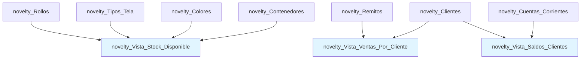
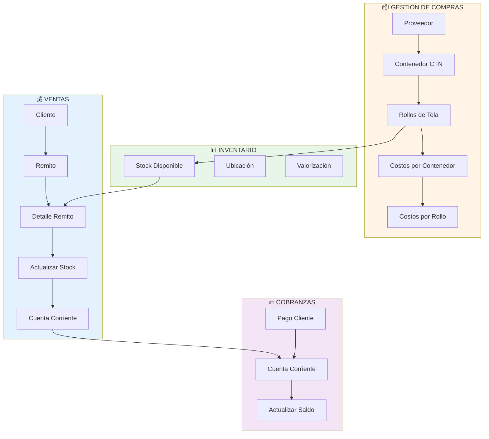

# Diagrama de Base de Datos - Novelty Trend ERP

## Esquema Entidad-Relación

```mermaid
erDiagram
    novelty_Clientes ||--o{ novelty_Remitos : "realiza"
    novelty_Clientes ||--o{ novelty_Pagos : "efectua"
    novelty_Clientes ||--o{ novelty_Cuentas_Corrientes : "tiene"
    
    novelty_Proveedores ||--o{ novelty_Contenedores : "suministra"
    
    novelty_Contenedores ||--o{ novelty_Rollos : "contiene"
    novelty_Contenedores ||--o| novelty_Costos_Contenedor : "tiene"
    
    novelty_Tipos_Tela ||--o{ novelty_Rollos : "clasifica"
    novelty_Colores ||--o{ novelty_Rollos : "define"
    
    novelty_Rollos ||--o{ novelty_Remitos_Detalle : "incluye"
    novelty_Rollos ||--o| novelty_Costos_Rollo : "tiene"
    
    novelty_Remitos ||--o{ novelty_Remitos_Detalle : "contiene"
    novelty_Remitos ||--o{ novelty_Pagos : "cancela"
    novelty_Remitos ||--o{ novelty_Cuentas_Corrientes : "genera"
    
    novelty_Pagos ||--o{ novelty_Cuentas_Corrientes : "registra"
    
    novelty_Clientes {
        int Id PK
        string Nombre
        string Razon_Social
        string CUIT
        string Domicilio
        string Telefono
        string Email
        string Condicion_IVA
        string Condicion_Pago
        string Tipo_Cambio
        decimal Saldo_ARS
        decimal Saldo_USD
        string Estado
        timestamp Created_At
        timestamp Updated_At
    }
    
    novelty_Proveedores {
        int Id PK
        string Nombre
        string Razon_Social
        string CUIT
        string Pais_Origen
        string Telefono
        string Email
        string Condicion_Pago
        string Estado
        timestamp Created_At
    }
    
    novelty_Tipos_Tela {
        int Id PK
        string Nombre
        string Descripcion
        string Unidad_Medida
        string Estado
    }
    
    novelty_Colores {
        int Id PK
        string Nombre
        string Codigo_Hex
        string Estado
    }
    
    novelty_Contenedores {
        int Id PK
        int Id_Proveedor FK
        string Numero_CTN
        date Fecha_Arribo
        decimal Peso_Total_Kg
        int Cantidad_Rollos
        string Estado
        string Notas
        timestamp Created_At
    }
    
    novelty_Rollos {
        int Id PK
        string Codigo_Barras UK
        string Numero_Rollo
        int Id_Contenedor FK
        int Id_Tipo_Tela FK
        int Id_Color FK
        decimal Peso_Kg
        decimal Peso_Inicial_Kg
        decimal Metros
        string Ubicacion
        string Estado
        decimal Precio_Costo_Por_Kg
        decimal Precio_Venta_Por_Kg
        string Lote
        date Fecha_Ingreso
        date Fecha_Venta
        string Notas
        timestamp Created_At
        timestamp Updated_At
    }
    
    novelty_Remitos {
        int Id PK
        int Numero_Remito UK
        int Id_Cliente FK
        date Fecha_Emision
        string Estado
        string Moneda
        decimal Tipo_Cambio_Aplicado
        decimal Total_ARS
        decimal Total_USD
        decimal Peso_Total_Kg
        string Observaciones
        timestamp Created_At
    }
    
    novelty_Remitos_Detalle {
        int Id PK
        int Id_Remito FK
        int Id_Rollo FK
        string Tipo_Tela
        string Color
        decimal Peso_Kg
        decimal Precio_Por_Kg
        decimal Subtotal
        decimal Total
    }
    
    novelty_Pagos {
        int Id PK
        int Id_Cliente FK
        int Id_Remito FK
        date Fecha_Pago
        decimal Monto_ARS
        decimal Monto_USD
        string Metodo_Pago
        int Numero_Recibo
        string Banco
        string Numero_Cheque
        date Fecha_Acreditacion
        string Estado
        string Observaciones
        timestamp Created_At
    }
    
    novelty_Cuentas_Corrientes {
        int Id PK
        int Id_Cliente FK
        date Fecha
        string Tipo_Movimiento
        int Id_Remito FK
        int Id_Pago FK
        decimal Debe_ARS
        decimal Haber_ARS
        decimal Saldo_ARS
        decimal Debe_USD
        decimal Haber_USD
        decimal Saldo_USD
        string Descripcion
        date Fecha_Vencimiento
        string Estado
        timestamp Created_At
    }
    
    novelty_Costos_Contenedor {
        int Id PK
        int Id_Contenedor FK
        decimal Flete_USD
        decimal Aduana_ARS
        decimal Otros_Gastos_ARS
        decimal Total_Costos_USD
        decimal Total_Costos_ARS
        decimal Tipo_Cambio_Usado
        string Notas
        timestamp Created_At
    }
    
    novelty_Costos_Rollo {
        int Id PK
        int Id_Rollo FK
        decimal Costo_Unitario_USD
        decimal Costo_Unitario_ARS
        decimal Costo_Flete_Proporcional
        decimal Costo_Aduana_Proporcional
        decimal Costo_Total_Por_Kg
        timestamp Created_At
    }
    
    novelty_Tipos_Cambio {
        int Id PK
        date Fecha
        string Tipo
        decimal Valor
        timestamp Created_At
    }
    
    novelty_Auditoria {
        int Id PK
        string Tabla
        string Operacion
        int Id_Registro
        string Usuario
        jsonb Datos_Anteriores
        jsonb Datos_Nuevos
        timestamp Created_At
    }
```



## Vistas Materializadas



### novelty_Vista_Stock_Disponible
Muestra el stock actual agrupado por tipo de tela y color:
- Total de rollos disponibles
- Peso total en Kg
- Valor estimado del inventario

### novelty_Vista_Ventas_Por_Cliente
Resume las ventas totales por cliente:
- Total de remitos
- Suma de ventas en ARS y USD
- Peso total vendido

### novelty_Vista_Saldos_Clientes
Calcula los saldos actuales de cada cliente:
- Saldo en ARS y USD
- Deuda vencida
- Último movimiento

## Flujo de Datos Principal



## Índices de Performance

```
📈 novelty_Rollos:
   - idx_rollos_estado (Estado)
   - idx_rollos_contenedor (Id_Contenedor)
   - idx_rollos_tipo_color (Id_Tipo_Tela, Id_Color)
   - UK: Codigo_Barras

📈 novelty_Remitos:
   - idx_remitos_cliente (Id_Cliente)
   - idx_remitos_fecha (Fecha_Emision)
   - idx_remitos_estado (Estado)
   - UK: Numero_Remito

📈 novelty_Pagos:
   - idx_pagos_cliente (Id_Cliente)

📈 novelty_Cuentas_Corrientes:
   - idx_cobranzas_cliente (Id_Cliente)
   - idx_cobranzas_vencimiento (Fecha_Vencimiento)
```

## Tipos de Datos Importantes

### Estados
- **Rollos**: Disponible, Reservado, Vendido
- **Remitos**: Borrador, Pendiente, Entregado, Facturado, Cancelado
- **Pagos**: Pendiente, Confirmado, Rechazado
- **Cuentas Corrientes**: Pendiente, Pagado, Vencido, Cancelado
- **General**: Activo, Inactivo

### Monedas
- ARS (Pesos Argentinos)
- USD (Dólares Estadounidenses)

### Tipos de Cambio
- Oficial
- Blue
- MEP
- CCL
- Celeste (personalizado)

### Métodos de Pago
- Efectivo
- Transferencia
- Cheque
- Tarjeta de Crédito
- Tarjeta de Débito

### Condiciones IVA
- Responsable Inscripto
- Monotributo
- Consumidor Final
- Exento

## Relaciones Clave

### 1:N (Uno a Muchos)
- Un Cliente tiene muchos Remitos
- Un Cliente tiene muchos Pagos
- Un Proveedor tiene muchos Contenedores
- Un Contenedor tiene muchos Rollos
- Un Remito tiene muchos Detalles

### 1:1 (Uno a Uno)
- Un Contenedor tiene un registro de Costos_Contenedor
- Un Rollo tiene un registro de Costos_Rollo

## Integridad Referencial

Todas las relaciones tienen **ON DELETE RESTRICT** para prevenir eliminaciones accidentales que rompan la integridad de datos.

Para eliminar registros relacionados, primero debe:
1. Eliminar los registros dependientes (hijos)
2. Luego eliminar el registro padre

---
**Generado:** 24/10/2025  
**Sistema:** Novelty Trend ERP - Gestión Textil  
**Base de Datos:** PostgreSQL (Supabase)
